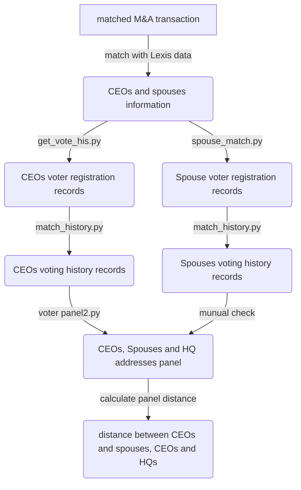

## Goal
---
Create an address panel data for all M&A target companies' CEOs and their spouses based on voting history records.
  
## Data Source
---
Voting history data
Lexisnexis data (personal address data)
SEC edgar data (Head quarter address)
  
## Process flowchart
---

  
## Code detail
---
1. Match voting registration records based on first name, last name, date of birth, houses address (from Lexis data), spouse information. 
2.  Manual checking is needed when searching voting history because different states' voting data has different variables.
3.  Check if voting registration addresses are listed in Lexis reports
4.  Extract Headquarter address from HQ address panel created in RA_work1
5.  When there are no voting records in a particular year, use the house address with the maximum number of household members in Lexis reports.