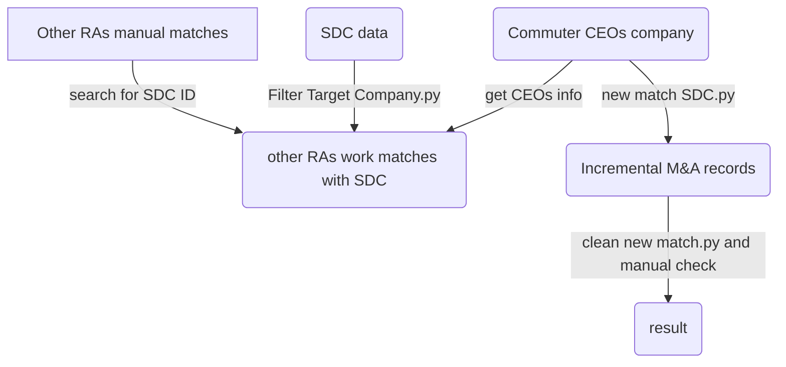

## Goal:
---
- Get incremental M&A transactions related to commuters' companies from SDC data
- Search other RAs matching results in SDC data
  
## Data Source
---
**SDC data**: contains company merger and acquisition transactions

  
## Process flowchart
---

  
## Code detail
---
#### Get increment matches
1. Fuzzy search for companies name
2. Search for 6-digit CUSIP first and then manually check
3. Search for the first 5 CUSIP digits and set the flag to identify if the deal synopsis contains the company name
#### Identify other RAs' work in SDC
1.  Get SDC ID: Fuzzy search for target company name and acquirer company name in SDC data
2.  Get CEO ID: Fuzzy search CEOs' names and their companies' names in 'commuter file'(data that contains commuter CEO information)