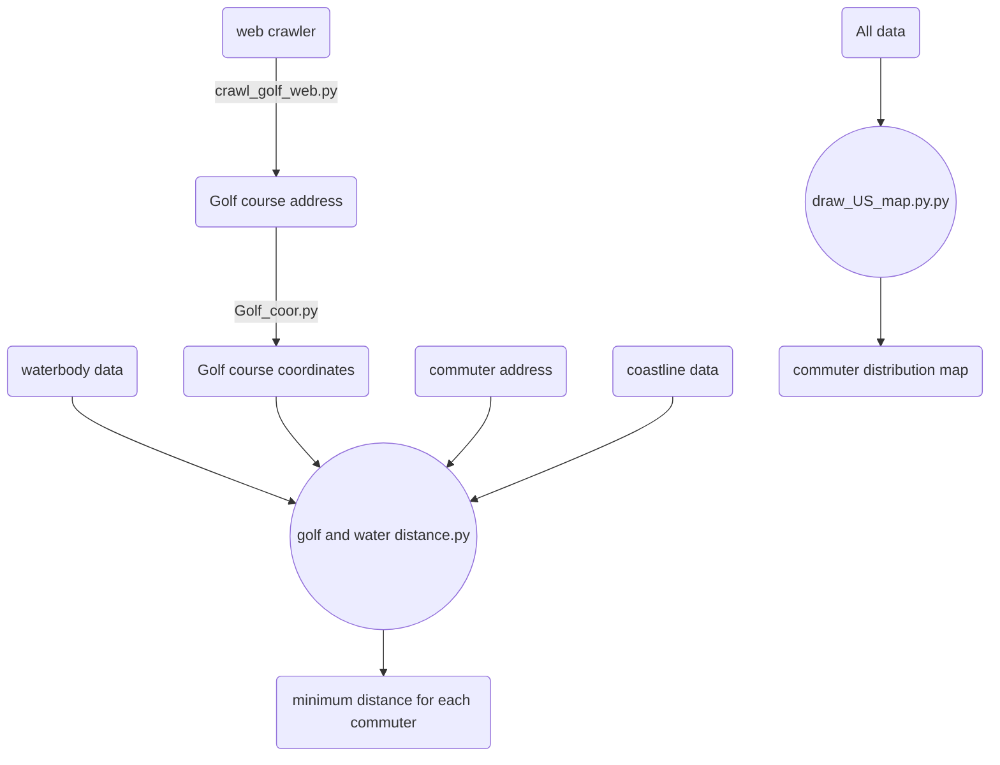

## Goal:
---
1. Calculate the **closest** distance from CEOs home addresses (and companies' HQ addresses) to waterbody, coastline and golf courses.
2. Plot a **map** of commuters home addresses.
  

## Data source
---
#### Waterbody and Coastline
After manually checking results of following three data sources, I found OpenStreetMap is the most accurate one. The final result was calculated using **OpenStreetMap**. 

The followings are waterbody and coastline geo-data sources that I have tested:

* **OpenStreetMap**: <u>https://www.openstreetmap.org</u> 
* **Esri**: <u>https://hub.arcgis.com/datasets/esri::usa-detailed-water-bodies/explore?location=32.837100%2C-113.614487%2C4.63&showTable=true</u>
* **USGS** <u>https://www.sciencebase.gov/catalog/item/4fb55df0e4b04cb937751e02</u>
* **US Census Bureau**: <u>https://catalog.data.gov/dataset/tiger-line-shapefile-2019-nation-u-s-coastline-national-shapefile</u>
  
## Processing flowchart
---

  

## Code detail
---
### Distance calculation
1. Used **Google geocode API** to get all CEOs' home addresses and headquarters' addresses coordinates.
2. Extracted waterbody polygon data and coastline linearity data from **OpenStreetMap**
3. Converted coordinate system from **WGS84** (latitude and longitude coordinates) to **EPSG:3310** (meter coordinates)
4. Impose **'cut-off'** restriction to filter water bodies that are larger than 'cut-off' (like 1 square mile, 10 square miles)
5.  Iterate commuter file to calculate distance from every CEO's home address (and HQ address) to every waterbody (every golf course) and then get the **minimum distance**.

### Plot map
Use **three different layers** of geodata (coastline, state border, waterbody) to plot the **background**. Add annotation for each state. Then Scatter plot commuters home addresses