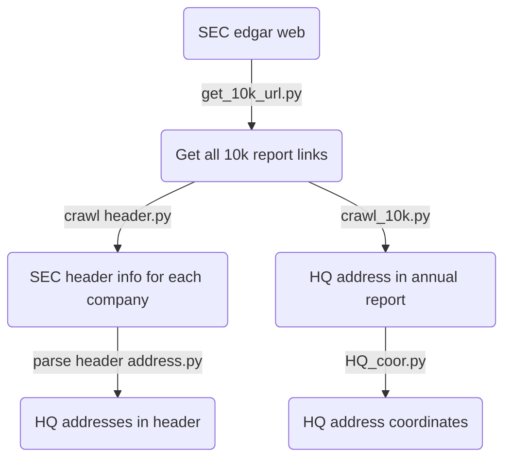

## Goal:

---

1.  Get all companies' Headquarter addresses from 2000 to 2020.
2.  Find records that companies relocate their headquarters.
  

## Data source
---
**SEC EDGAR**: <u>https://www.sec.gov/cgi-bin/srch-edgar</u>

  

## Processing flowchart
---

  
## Code detail

---

### Get url
Get all 10k reports' **URL links**. There are three different types of financial reports: **10-K** (Regular annual report),**10-K405** (Delayed report),**10-KSB** (Small business).

### Get address
1. Address in **'header'**: 'header' usually appears before report content in Html, which is not shown directly in the website. It is usually **standardized**, so it's easy to use a regular expression (**regex**) to parse. However, addresses in the header are usually **out-of-date**. It's hard to identify when a company relocates its HQ accurately.
2. Address in **annual report (10k)**: Because the time range is so long, Html evolves through 3 **different formats** (old Html, Html, iXBRL). So I need to **cut**  the first page of each report, then parse this small part. Many HQ addresses are in **certain position**. But some of them are not in the standard format. I created a sophisticated **address regex** to capture the remaining HQ addresses. Besides, there is also a situation that financial reports containing **multiple** companies. In this case, I search for the target company name first and then search for the HQ address

### HQ Relocation
I also search for **headquarter relocation indicator**: whether this company relocates its headquarters this year.
1.  **Search** every 10k report for specific **keywords**. For example, search 'headquarters' first and then search for 'relocate' around 50 words of the first search. I used a list of keywords in the code.
2.  Because the address' format is slightly different from year to year. I need to calculate **the similarity** between this year's HQ address and last year's address. Usually, when 'similarity'<80%, it indicates the change of HQ address.