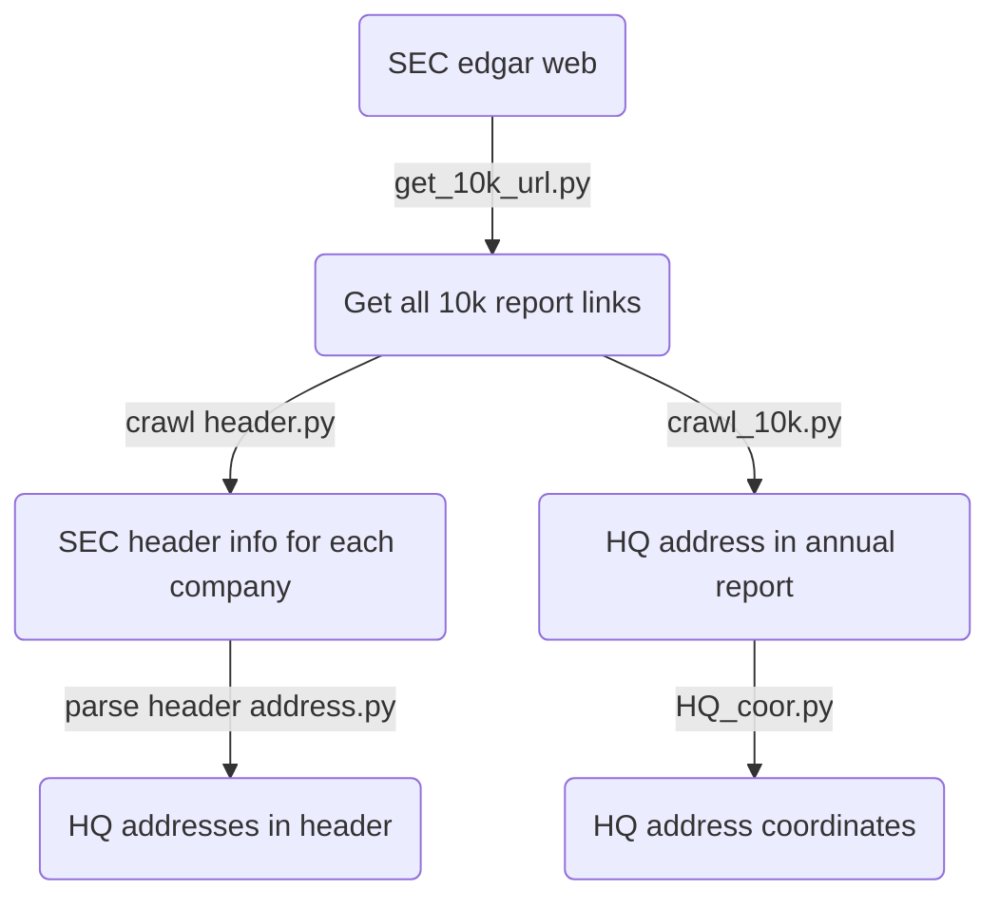

## Goal:

---

1.  Get all companies' Headquarter addresses from 2000 to 2020.
2.  Find all records that company relocate its headquarter.
  

## Data source
---
**SEC EDGAR**: <u>https://www.sec.gov/cgi-bin/srch-edgar</u>

I also manually checked all companies' headquarter addresses from 2000 to 2020. If you need this data for research, please contact me.*
  

## Processing flowchart
---

  
## Code detail

---

### Get url
Get all 10k reports' **url**. There are 3 different code which all represent financial anual report 10k: **10-K**,**10-K405** (Delayed report),**10-KSB** (Small business).

### Get address
1. Address in **header**: header usually appears before report content in html which is not shown directly in website. It is usually **standardized**, so it's easy to use **regex** to parse. However, addresses in header is usually **out-of date**. It's hard to accurately identify when company relocate its HQ.
2. Address in **annual report (10k)**: Becasue time range is so long, html evloves through 3 **different formats** (old html, html,iXBRL). So I need to **cut**  the first page of each report, then parse this small part. A lot of HQ addresses are in **certain position**, like, before '(address of principle address)'. But there are also some of them are not in standard format. I create a complex **address regex** to capture the remaining HQ addresses. Besides, there is also a situation that financial reports contain **multiple** companies. In this case, I search for target company name first and then search for the HQ address

### HQ Relocation
I also search for **Headquarter relocation indicator**: weather this company rellocate its headerquarter in this year.
1.  **Search** every 10k report for certain **keywords**. For example, search 'headquarter' first and search 'relocate' around 50 words of the first search. I used a list of keywords in code.
2.  Because address' format is slightly different from year to year. I need to **calculate similarity** of a company's this year's HQ address and its last year address. Usually 'similarity'<80% indicate the change of HQ address.
