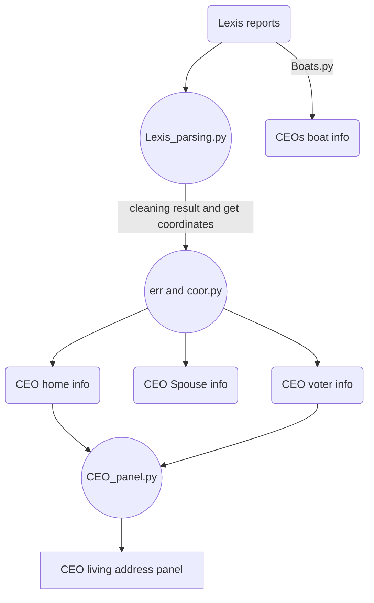
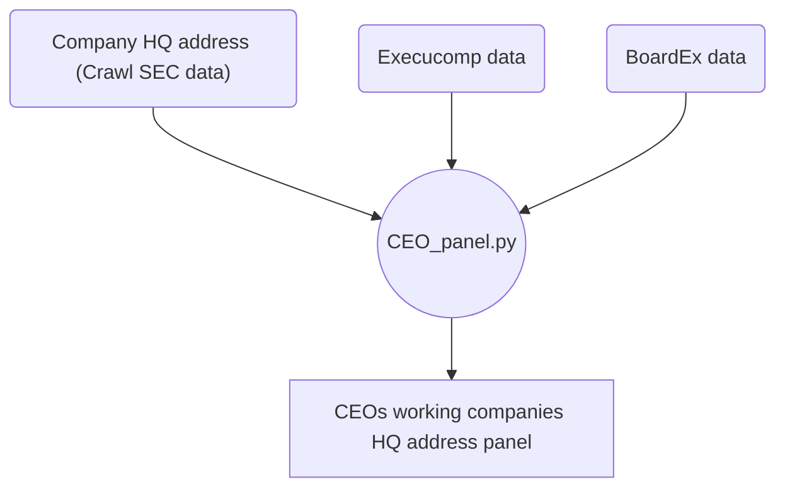

## Goal:
---
1.  Get CEOs, their spouses and voter history records from LexisNexis data. 
2.  Get panel data of CEOs living addresses and their companies' headquarter addresses from 2000 to 2020
  

## Data source
---
**LexisNexis**: CEOs information

**Compustat Execucomp** and **BoardEx** : CEOs current and previous working company and title
**Company HQ address**: crwaled from SEC 10k reports (2.Crawl SEC data)
  

## Process flowchart
---

  

## Code detail
---
#### Parsing
Since all reports are in same format, I just create some **searching functions** for different **text structure**, e.g. search the content after a keyword; search the content in the next line of a keyword. For addresses, we need to get a list of them. So I search for the beginning and ending of this section(like house address section), and **seperate** them based on some **delimeter** like (/n). And then parse each one using searching function I created

#### Panel (2000-2020)
**Home address**: For every year, I use house with **max value** and with **max household members** seperately as proxy for CEOs living address. 

**HQ address**: I collect CEOs previous working companies' HQ addresses from **Compustat Execucomp** and **BoardEx**. And then use CIK to match with crawled **Company HQ address**