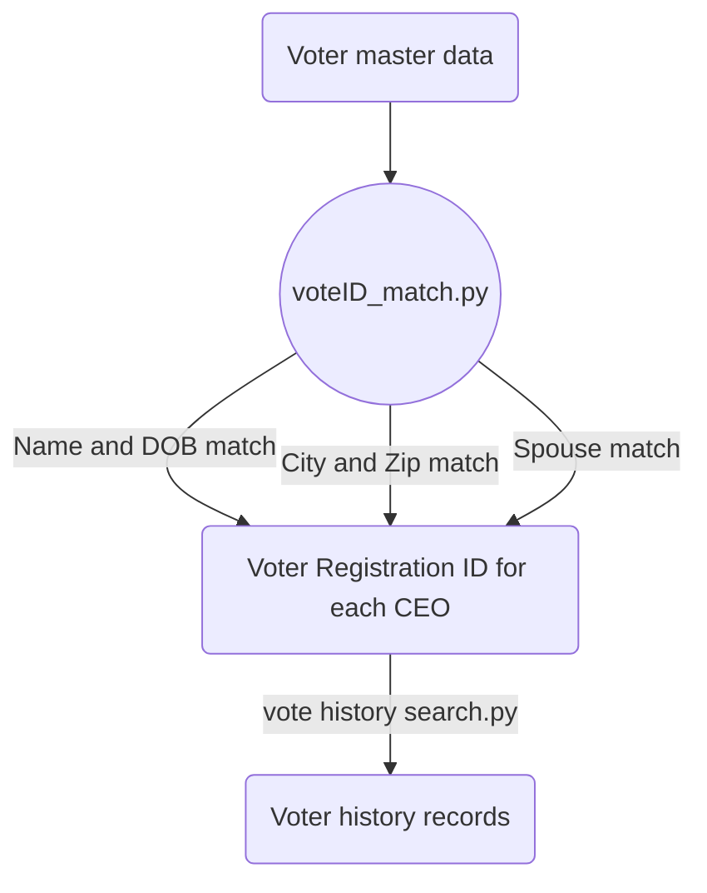

## Goal:
---
Get all CEOs voting history to identify their living addresses.
  
## Data source
---
**Voter History** and **Voter Registration**
  
## Processing flowchart
---

  

## Code detail
---
I use multiprocessing to do big-data match.

Since there are no link between Voter registrantion ID and Lexis ID, I need to match them based on CEOs info. There are three ways to match them.
1.  Based on CEOs first and last name, first character of middle name, month and year of birth 
2.  Based on CEOs' house address city and zip code. If CEOs have houses in this city or this zip code, then search CEOs name and DOB
3.  Regardless CEOs' house address, search CEOs' name and DOB and their spouses' name and DOB. If both matching results have same addresses, we consider it as a solid match. Because CEOs and their spouse live together in a same address