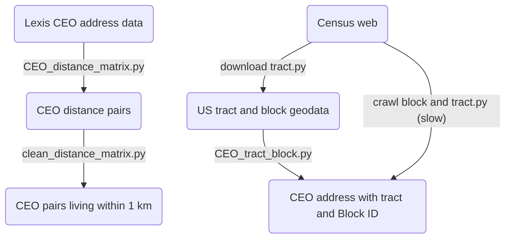

## Goal:
---
1.  Get CEOs pairs who live in 1km away to each other.
2.  Get CEOs who live in same block and same tract.
  

## Data source
---
**LexisNexis Data**: CEOs addresses information

**Census tract and block data**: <u>https://www2.census.gov/geo/tiger/TIGER2020/TRACT</u>

**Census geocoder** :<u>https://geocoding.geo.census.gov/geocoder/geographies/coordinates</u>
  

## Processing flowchart
---

  

## Code detail
---
**Multiprocessing** for big-data calculation and matching
### Distance matrix
1.  Get all CEOs home addresses coordinates and **translate** into meter coordinates.
2.  For each CEO, remove his/her addresses in whole dataset first and then calculate the distance to every other address (**distance matrix**)
3. write down every calculation into a file named by LexID

### Get Tract and Block ID
1.  **Restricting search range** can save a lot of time. For **TractID**, label geodata into different state name and then for each address search only in its state's tract data. For **BlockID**, similarily search each block based on TractID first.
2. **Alternative way**: Just crawl from census geocoder website, it's easy but slow for big data